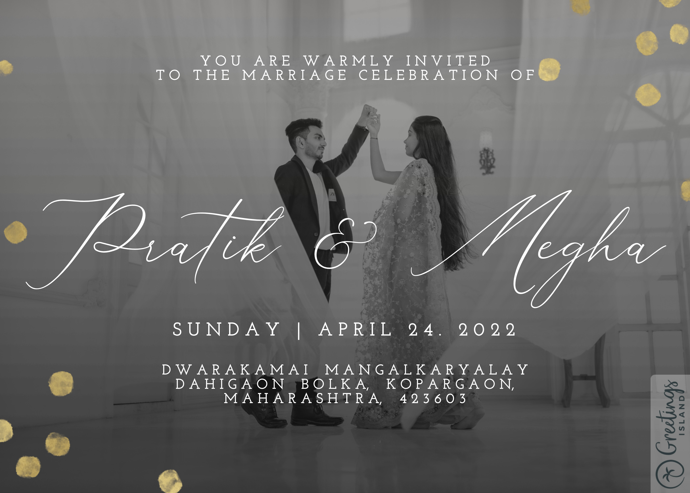

<p align="center"><a href="https://www.sarthakj.me/WeddingEvite/"></a></p>
<h1 align="center"><a href="https://pratikmegha.netlify.app/assets/SI.pdf">Wedding Invitation</a> :ring: <br> <br> SAVE THE DATE: 24th Apr, 2022 <br> <a href="https://pratikmegha.netlify.app/">Website</a></h1>

## Wedding Invitation :ring:

<details>
  <summary><strong>View Invitation</strong></summary>
  <a href="https://pratikmegha.netlify.app/"></a>
</details>

With the divine grace of the almighty, inviting you and your family to Pratik's wedding to be held on **24th April 2022 at [Dwarka Mangal Karayalaya](https://goo.gl/maps/BZVS1hy9Bd7Hx1Cv7), Dahigaon Bolka, Maharashtra 423603 from 12:30 PM** onwards.

-   [Download](https://pratikmegha.netlify.app/assets/thoratkanadeweddinginvitation.jpeg) the Invitation card

-   Find [venue](https://goo.gl/maps/BZVS1hy9Bd7Hx1Cv7) on Google map

-   Visit the [website](https://pratikmegha.netlify.app) for more details

```js
const newCouple = "Pratik & Megha";

// Apr 24, 2022
const weddingDate = new Date(2022, 04, 24);

// Wedding venue: -  https://goo.gl/maps/BZVS1hy9Bd7Hx1Cv7
const weddingVenue = new Location(
    "Dwarka Mangal Karayalaya, Dahigaon Bolka, Kopargaon, Maharashtra"
);

(function () {
    newCouple.willTieKnot(weddingDate);

    // your presence is requested
    new Wedding().acceptInvitation(
        window.open("https://pratikmegha.netlify.app/")
    );
})();
```

## Are you or your loved ones a _bride-to-be_ or _groom-to-be_?

> Feel free to use this template to build your wedding website!

### Do not forget to leave a star! :hugs:

<br><sup><i>With warm regards,<br>
**Pratik Thorat**<i></sup><br>

## Credits for the Project

-   Sarthak Jain - Github - https://github.com/sarthak-1998

-   Vinit Shahdeo - GitHub - https://github.com/vinitshahdeo Project - https://github.com/vinitshahdeo/Wedding-Invitation

-   Sanket Singh - GitHub - https://github.com/singhsanket143 LinkedIn - https://www.linkedin.com/in/singhsanket143/
